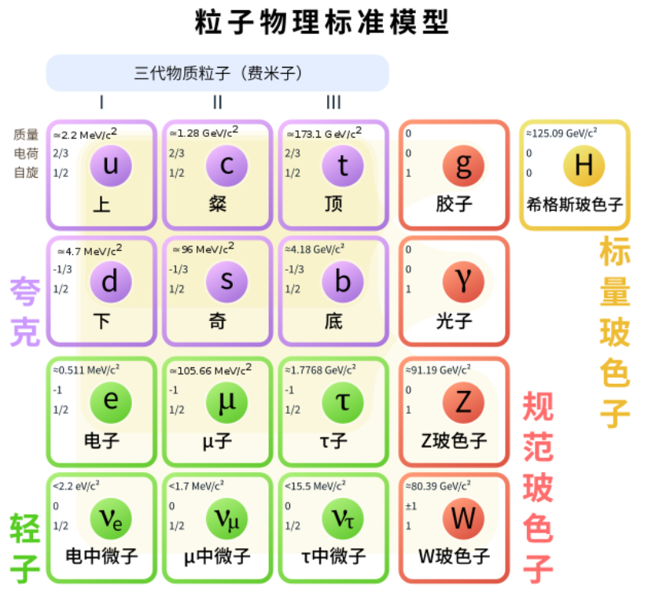

# Zhao Jun's Home Page

https://arxiv.org/

## Mathematics

## Physics

## Wireless&Information

## Computer

#### RISC-[V](https://gitee.com/xiaowuzxc/SparrowRV?_from=gitee_search)

[RISC-V International (riscv.org)](https://riscv.org/)

[RISC-V - OSDev Wiki](https://wiki.osdev.org/RISC-V)

[RISC-V资源列表 - CNRV](https://cnrv.io/resource)

[RISC-V - 知乎 (zhihu.com)](https://www.zhihu.com/topic/20075426/hot)

[从零开始写RISC-V处理器](https://liangkangnan.gitee.io/2020/04/29/从零开始写RISC-V处理器/)

gitee上risc-v的工具链，下载速度很快。

[riscv-gnu-toolchain ](https://gitee.com/mirrors/riscv-gnu-toolchain?_from=gitee_search)

现在gitee和github实现了同步
